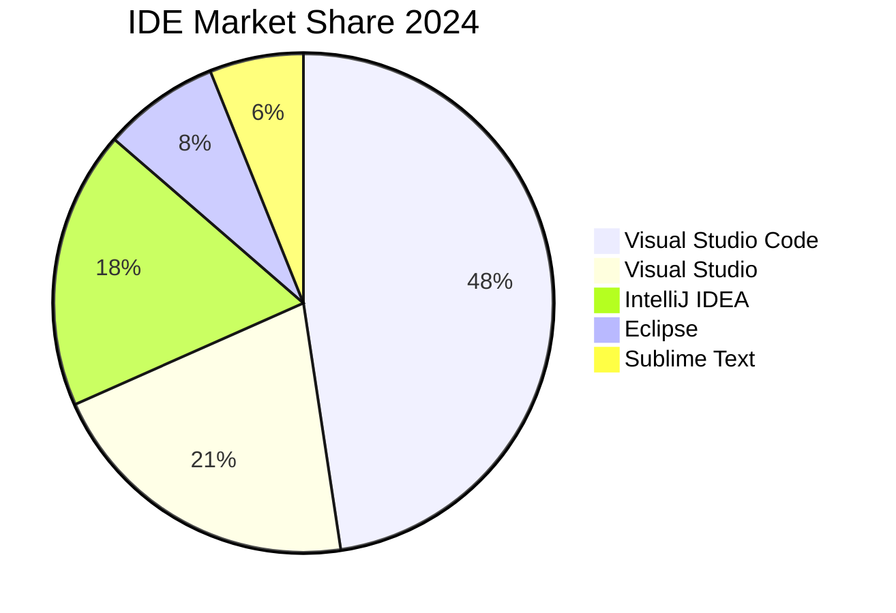
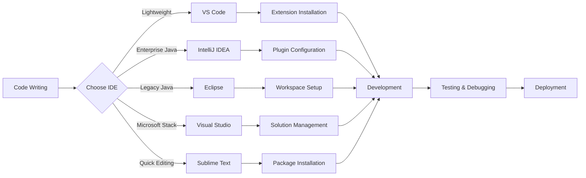

# 🚀 MicroDemo: Top 5 IDEs in the Market

Welcome to the **MicroDemo** repository! This project showcases the top 5 Integrated Development Environments (IDEs) that are currently dominating the software development landscape.

## 🎯 Overview

This repository provides an overview of the most popular and powerful IDEs used by developers worldwide. Whether you're a beginner or an experienced developer, choosing the right IDE can significantly impact your productivity and coding experience.

## 📊 IDE Comparison Diagram

```mermaid
graph TD
    A[Top 5 IDEs] --> B[Visual Studio Code]
    A --> C[IntelliJ IDEA]
    A --> D[Eclipse]
    A --> E[Visual Studio]
    A --> F[Sublime Text]
    
    B --> B1[Free & Open Source]
    B --> B2[Lightweight]
    B --> B3[Extensive Extensions]
    
    C --> C1[Powerful Java Support]
    C --> C2[Smart Code Completion]
    C --> C3[Built-in Tools]
    
    D --> D1[Java Enterprise]
    D --> D2[Plugin Ecosystem]
    D --> D3[Free & Open Source]
    
    E --> E1[Microsoft Ecosystem]
    E --> E2[Professional Grade]
    E --> E3[Integrated Debugging]
    
    F --> F1[Fast & Lightweight]
    F --> F2[Minimalist Design]
    F --> F3[Powerful Editing]
    
    style A fill:#e1f5fe
    style B fill:#c8e6c9
    style C fill:#ffecb3
    style D fill:#f8bbd9
    style E fill:#d1c4e9
    style F fill:#ffccbc
```

## 🏆 Top 5 IDEs

### 1. 🔷 Visual Studio Code
- **Developer**: Microsoft
- **Type**: Free, Open Source
- **Languages**: Universal (supports almost all programming languages)
- **Key Features**:
  - Lightweight yet powerful
  - Extensive marketplace with thousands of extensions
  - Built-in Git integration
  - IntelliSense code completion
  - Integrated terminal
- **Best For**: Web development, Python, JavaScript, TypeScript, and general-purpose coding

### 2. 🟠 IntelliJ IDEA
- **Developer**: JetBrains
- **Type**: Commercial (with Community Edition available)
- **Languages**: Java, Kotlin, Scala, Groovy (Ultimate supports more)
- **Key Features**:
  - Superior code intelligence and assistance
  - Advanced refactoring tools
  - Built-in version control
  - Database tools and SQL support
  - Comprehensive testing framework integration
- **Best For**: Java enterprise development, Android development, and JVM-based languages

### 3. 🟣 Eclipse
- **Developer**: Eclipse Foundation
- **Type**: Free, Open Source
- **Languages**: Java, C/C++, PHP, Python (via plugins)
- **Key Features**:
  - Robust plugin architecture
  - Strong Java development tools
  - Integrated build automation
  - Team collaboration features
  - Extensive debugging capabilities
- **Best For**: Java development, enterprise applications, and academic projects

### 4. 🔵 Visual Studio
- **Developer**: Microsoft
- **Type**: Commercial (with Community Edition available)
- **Languages**: C#, VB.NET, C++, F#, Python, JavaScript
- **Key Features**:
  - Professional-grade debugging and diagnostics
  - Seamless integration with Microsoft technologies
  - Advanced IntelliSense
  - Live collaboration features
  - Comprehensive testing tools
- **Best For**: .NET development, Windows applications, and Microsoft ecosystem projects

### 5. 🟡 Sublime Text
- **Developer**: Sublime HQ
- **Type**: Commercial (with unlimited trial)
- **Languages**: Universal (supports most programming languages)
- **Key Features**:
  - Extremely fast and responsive
  - Multiple selections and split editing
  - Command palette for quick access
  - Distraction-free mode
  - Highly customizable
- **Best For**: Quick editing, text manipulation, and developers who prefer minimalist interfaces

## 📈 Market Share & Popularity

## 🔄 Development Workflow Comparison

## 🚀 Getting Started

To explore these IDEs:

1. **Visual Studio Code**: Download from [code.visualstudio.com](https://code.visualstudio.com/)
2. **IntelliJ IDEA**: Download from [jetbrains.com/idea](https://www.jetbrains.com/idea/)
3. **Eclipse**: Download from [eclipse.org](https://www.eclipse.org/)
4. **Visual Studio**: Download from [visualstudio.microsoft.com](https://visualstudio.microsoft.com/)
5. **Sublime Text**: Download from [sublimetext.com](https://www.sublimetext.com/)

## 🤝 Contributing

Feel free to contribute to this repository by:
- Adding more IDE comparisons
- Updating features and information
- Improving the Mermaid diagrams
- Sharing your IDE experiences

## 📝 License

This project is open source and available under the [MIT License](LICENSE).

## 🔗 Useful Links

- [Stack Overflow Developer Survey 2024](https://survey.stackoverflow.co/)
- [JetBrains Developer Ecosystem Survey](https://www.jetbrains.com/lp/devecosystem-2024/)
- [GitHub State of the Octoverse](https://github.blog/news-insights/state-of-the-octoverse/)

---

⭐ **Star this repository if you found it helpful!**

*Last updated: June 2025*
